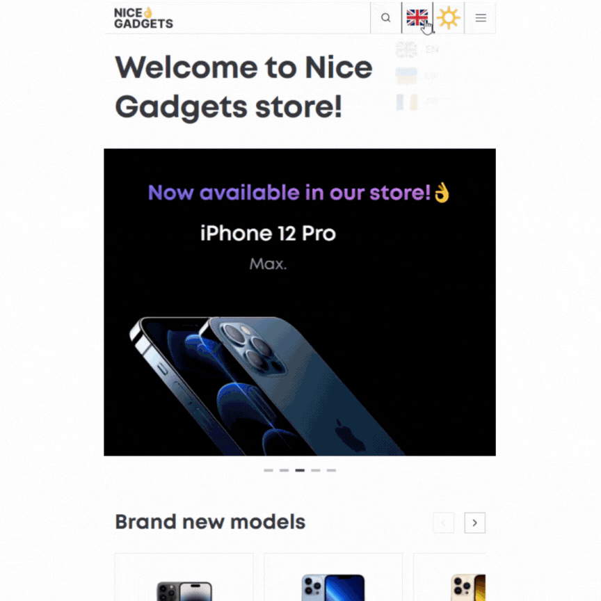
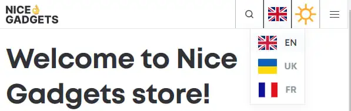
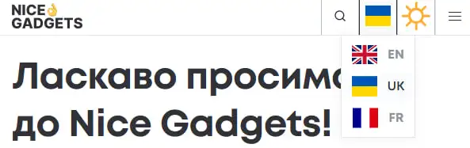
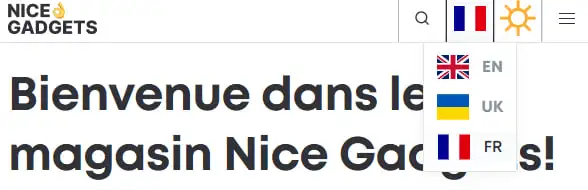
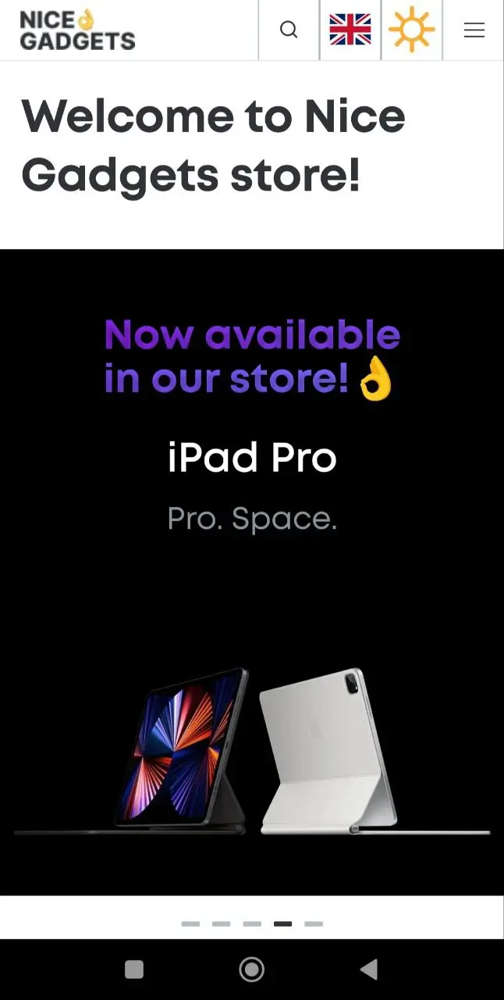
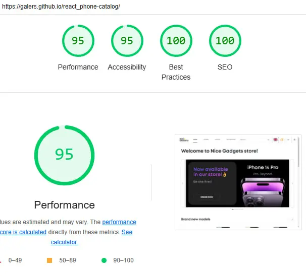

# 

 &nbsp;Nice Gadgets&nbsp; 

## Table of Contents

- [Project Overview](#project-overview)
- [Design and figma ](#design)
- [Technologies used](#stack-technologies-were-used)
- [Features](#features)
- [Theme toggle](#color-schemes)
- [Installation and Setup](#get-the-initial-code)
- [Author](#author)

## Project Overview

This catalog application provides users with a seamless shopping experience, allowing them to browse and filter products by categories (phones, tablets, and accessories), view product details, add items to a shopping cart or favorites list, and explore similar items. The app also features search functionality, theme switching, and multi-language support.

### Link by catalog 🔗👇

- [DEMO LINK](https://galers.github.io/portfolio-product-catalog/)

## Design

The design of this product catalogue app focuses on creating a modern and minimalist aesthetic, while providing a seamless shopping experience across devices.

The app is designed with a responsive layout that adapts to the screens of both desktop and mobile devices. It also features swipe-based navigation and pagination, allowing users to easily browse content.

Users have the option to choose a light or dark theme, allowing them to personalis their browsing experience. The site is also localized into three languages. The app also features sticky headers and footers that improve accessibility and navigation.

Hover effects and interactive elements add elegance and dynamism to the user experience, and the homepage features sections with hot deals and new arrivals. The app offers separate pages for different product categories with sorting and filtering options for easy navigation.

### Link by figma design

- [Figma Original design (Light Theme)](<https://www.figma.com/file/T5ttF21UnT6RRmCQQaZc6L/Phone-catalog-(V2)-Original>)
- [Figma Original Dark design (Dark Theme)](<https://www.figma.com/file/BUusqCIMAWALqfBahnyIiH/Phone-catalog-(V2)-Original-Dark>)

In addition, [theme-switching](#color-schemes) functionality may be enabled to allow users to toggle between themes dynamically.

## <h2 id="stack-technologies-were-used">Stack technologies were used 🛠️</h2>

- 
- [i18next](#localization-i18n)
- **React Router** for page routing.
- [React context for theme toggle](#color-schemes)
- `localStorage` for data persistence (favorites, cart, theme and localization).

### Libraries

- Framer <b style="color:#f300aa;">Motion.</b>
- 
Hamburger-react 

## Features

Here are some of the features of this website:

### Responsive layout

The website is fully responsive, has 5 breakpoints and reacts to orientation
change.

#### Screen Adaptations:

- The design <1200px
- Desktop >1199px
- Small desktop >992px
- Tablet >764px
- [Mobile (>640px)](#mobile-friendly)

### Color schemes

The website features **_light_** and **_dark_** color schemes switch. By default, the switch is set to **_'auto'_**, meaning that the website follows the system / browser current mode. If a dark or light color scheme is switched on manually, it will override the system setting.

- the selected color scheme is saved in `localStorage` and restored on next visit

 

### Localization-i18n

The site is available in three languages: **_English_**, **_Ukrainian_** and **_French_**. The selected language is saved to the local storage and restored at the next visit. The function of setting the default language for your browser has also been added.

Also, all images **_`alt`_**, **_`aria-label`_** and **_`title`_** are localized.

**_English:_**

**_Ukrainian:_**

**_French:_**

**_P.S. Unfortunately, I do not speak French and the translation was created 100% with the help of [deepl](https://www.deepl.com/), and my beloved girlfriend helped me with contextual translation. In general, the third language was chosen only for her❤️_**

### Keyboard-accessible and screen-reader-friendly

- all controls are focusable and keyboard-accessible
- all images have **_`alt`_**
- interactive elements without text have proper **_`aria-label`_**
- project cards in 'list' presentation have **_`aria-expanded`_** attributes

### Mobile-friendly

Not only doest the website have responsive layout, it also allows one-handed
operation in mobile mode, with color scheme and language menus.

Mobile mode also features a full-screen-view toggle for better experience.

### Optimization

- images are served in **webp** format and have been optimized with **[Squoosh](https://squoosh.app/)**

**_Lighthouse ratings:_**

## <h2 id="get-the-initial-code">Get the initial code 👨‍💻</h2>

1. `Clone` the repository:
   - `git clone` in your PC;
   - `code` (name project).
2. Run `npm install` to install the dependencies
3. Create a branch for you solution (e.g. `git switch -c develop`)
4. Run `npm start` to run a development server at http://localhost:3000 (If you need to stop the server press `ctrl + c` in the terminal window)

### Contributing

Contributions are welcome! Please feel free to fork the repository, create a new branch, and submit a pull request with your improvements.

## <h2 id="author">Author 🖋</h2>

[@Galers](https://www.linkedin.com/in/andriy-halosa-b0900a302/)

**_Thank you for your attention and GL_** 🥰🥰🥰
